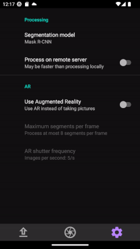

# Near Real-Time Fruit Quality Prediction with Augmented Reality 🍓

## Table of Contents

- [Description](#description)
- [Features](#features)
- [Requirements](#requirements)
- [Dependencies](#dependencies)
- [Used APIs](#used-apis)
- [Usage](#usage)
- [Installation](#installation)
- [Architecture](#architecture)
- [Pipeline](#pipeline)
  - [Normal Camera Mode](#normal-camera-mode)
  - [Uploading Image](#uploading-image)
  - [Augmented Reality Mode](#augmented-reality-mode)
- [Availability](#availability)
- [Funding Information](#funding-information)
- [License](#license)
- [Citation](#citation)

## Description

This project contains an Android application that provides users with real-time strawberry quality prediction using their mobile device's camera. It utilizes machine learning models to calculate and predict strawberry qualities, such as ripeness, sweetness, and marketability. The app offers an interface that allows users to quickly access different parts of the application, such as the settings menu, the real-time camera, and the normal camera. An introduction to this app is available at **Junhan Wen, A. Dascalu, D. Drashkov, L. Marinski, M. A. Bhatti, M. Herrebout, M. Weinmann. (2023). _Demonstration of a Mobile Application for Near Real-Time Strawberry Quality Prediction._ Best Demo Award at BNAIC/BeNeLearn.**.

The building and training of the machine learning model used in this application are based on the original work by **Wen, J., Abeel, T., & De Weerdt, M. (2023). _“How sweet are your strawberries?”: Predicting sugariness using non-destructive and affordable hardware._ Frontiers in Plant Science, 14, 1160645.**. Please cite this paper if you use this project.

This project was developed in collaboration with [Delphy BV](https://delphy.nl/).

### Features

While using the application, user have access to the following features:

- Detecting strawberry qualities
- Clicking on individual strawberries to display relevant information
- Uploading images from the gallery for evaluation
- Switching between machine learning models
- Real-time or static evaluation of strawberries
- Saving results to the device's local storage
- 
## Requirements

- Android version 8 (Oreo) and above
- Android API level 26 - 33
- Functional device camera
- Internet connectivity for accessing remote resources
- Sufficient storage space for app installation (approx. 250 MB)
- Permission to access device camera for capturing photos
- External storage access for saving and retrieving files
- Recommended RAM: 2GB or more for optimal performance

Please ensure that your Android device meets the following requirements to run the application successfully. Older versions of Android or devices with API levels lower than 26 may not be compatible.

## Dependencies

- This application requires **no external dependencies**. It can be run standalone without the need to install any additional libraries, frameworks, or modules. All necessary components are bundled within the app itself.

To get started, follow the [installation](#installation) guide.

## Used APIs

### Roboflow

- Roboflow API: The application integrates with the Roboflow API to enable image segmentation. 
 This API allows the app to process and transform images. The application provides API access to
 the hosted models using a private API key for communication. No personal API key is required from users.
### CameraX

- CameraX API: The application leverages the CameraX API, a powerful library provided by Google, for camera functionalities. 
  CameraX simplifies the development of camera-related features in the app, allowing for efficient camera handling, image capture, and preview. 
  The integration of CameraX ensures a consistent and reliable camera experience across a wide range of Android devices. 

## Usage
Upon starting the application, users are met with several options.
- **Using the normal camera mode:** Users can capture photos of the strawberries using their back camera
  and process them in order to get a visual representation in the form of annotations of the segmented strawberries.
  These annotations are clickable, and upon clicking the user is presented with additional information.

           
  
- **Using the augmented reality mode:** Similar to the normal camera mode, but users do not need to take
  pictures of the strawberries. Instead, users can point their camera onto the strawberries and capture
  them in real-time, after which they can click on annotations to display their relevant features.

     
- **Uploading an image:** Users can also choose to upload an image from their device's gallery or
  through Google Drive. Upon uploading an image, the user has access to all of the features in the
  of the normal camera mode, such as processing and/or saving the image.

       

- **Changing settings and parameters:** Users also have access to a settings menu, from which they may change the models used for segmentation,
the configuration of the augmented reality mode, or using a server to process images. 

    
## Installation

### Building from source

1. Download the latest version of [Android Studio](https://developer.android.com/studio) for your
   operating system.
2. Clone the repository 
   ``` bash
    git clone https://gitlab.ewi.tudelft.nl/cse2000-software-project/2022-2023-q4/cluster-14/14c-fruit-quality-prediction-with-augmented-reality/fruit-quality-prediction.git
   ```
3. Import the cloned repository into Android Studio
4. Open the device manager.
  
    
   - Click `Create device`.
   
    
   - We recommend using Android API Level 33 and up. However, any version
     above API Level 28 will work correctly.
   
    
   - Set the camera to your computer's webcam. 
   
    

   - Click `Finish`. Your virtual emulated device is now ready.
5. Assure that your configurations contain the `app` configuration. If 
   it is not present, you can manually add it from the `Edit configurations` tab.
   
   
6. The app is now ready to be run. Click on the start button, while assuring
   that the current configuration is `app` and your device is the one you have
   created.

     

   In this scenario, the device is `Nexus 6P API 33`.

### APK Installation

1. Download the APK file for the app from the provided source. If compiling the APK using Android studio, follow these steps:
    - Open your project in Android Studio.
    - In the Project view, navigate to the "app" module.
    - Expand the "app" module and locate the "build" folder.
    - Inside the "build" folder, you will find another folder named "outputs".
    - Inside the "outputs" folder, you will find the APK file.
    - Copy the APK file to your desired location or transfer it to your Android device.
2. Transfer the APK file to your Android device using a USB cable or any other preferred method.
3. On your Android device, go to Settings and navigate to Security (or Privacy on some devices).
4. Enable the Unknown sources option to allow installation of apps from sources other than the Play Store.
5. Use a file manager app to locate the transferred APK file on your device.
6. Tap on the APK file to start the installation process.
7. Follow the on-screen instructions to install the app.
8. Once the installation is complete, you can find and launch the app from your device's app drawer or home screen.

## Architecture
The architecture of the project involves the application of pre-trained deep learning models to
predict the quality attributes of strawberries in greenhouses based on images. 
The overall goal is to have an end-to-end pipeline that is able to classify strawberries based on 
their qualities in near real time.

The application was built using Java in Android Studio.
This project also leverages the [OpenCV](https://opencv.org/) library, which provides a comprehensive set of computer vision 
algorithms and functions for the image processing tasks employed in the application.
These capabilities enable the application to preprocess the strawberry images, 
extract relevant features and segment images based on the contained strawberries.

To perform the prediction tasks, the project utilizes [TensorFlow Lite](https://www.tensorflow.org/lite) (TFLite) models. 
TFLite is a lightweight version of TensorFlow, a popular deep learning framework.
TFLite models are optimized for mobile and embedded devices, making them ideal for integration into this application. 
These models have been pre-trained on datasets from 2021 to accurately predict the quality attributes of strawberries 
based not only on their visual characteristics, but also environment data used for predicting qualities such as
the brix.

For the user interface, the project employs [Android's Layout Editor](https://developer.android.com/studio/write/layout-editor) to 
allow the creation of responsive and visually appealing interfaces.

The following diagrams illustrate the flow of the system:


**Figure 1:** Main Activity for the application.


**Figure 2:** The two main fragments for the application. The camera fragment is utilized for taking
images and processing them. The AR fragment processes frames in real time.


**Figure 3:** Flow diagram of the image processing and segmentation process.


**Figure 4:** Strawberry detection architecture. Three models are available: Color segmentation, segmentation using Roboflow API and
remote segmentation, which uses a YOLOX model.


**Figure 5:** Marketability Calculator. Uses ripeness, smoothness and roundness to compute values.


**Figure 6:** Brix and firmness calculation flow diagram.


**Figure 7:** The Base Calculator. Is used by Brix and firmness calculator.


**Figure 8:** Chart Generator. Generates charts based on ripeness values and displays them
in terms of time.


**Figure 9:** Annotator. Takes segments and draws the necessary bounding boxes, and handles
user interaction. Uses the previous chart, Brix, firmness, marketability, roundness, smoothness and ripeness 
values in order to create user dialogs.


**Figure 10:** Feedback Generator. Allows for sending feedback regarding segmentations from the camera views.


**Figure 11:** Preference Provider. Manages the preferences (settings) of the application.
Is used to retrieve currently selected settings.

## Pipeline

The architecture pipeline of the project follows a relatively linear path, from the moment of instantiating
an image to be processed, to the processing of said image. 

#### Normal Camera Mode
A typical case of application usage in the normal camera mode follows the ensuing workflow:

- **1. Picture taking:** A picture is taken using the device's camera, after which it is displayed in the 
    camera view.
- **2. Processing image:** Upon clicking the `Process` button, the image is then ran through 
    a `segmentation process`, which outputs the individual strawberry segments localized in the image.
    Using the strawberry segments, in combination with the original image, an `Annotator` is then responsible
    for annotating the original image with the corresponding bounding boxes of the strawberries.
    
    The annotator makes use of several calculators, namely the `Ripeness calculator`, the `Brix Calculator`
    and the `Marketability calculator`. These calculators are employed in the annotation step for each
    segmented strawberry in order to calculate the respective values, namely the ripeness, the brix and the marketability.
- **3. Outputting image:** The annotated image is then displayed in the original camera view, along with
    the new annotated bounding boxes. The `Annotator` is also responsible for enabling the functionality
    of clicking on the bounding boxes, by handling click events.
- **4. Viewing results:** Each bounding box can be tapped in order to display the strawberry qualities
    (ripeness, brix and marketability).

#### Uploading Image
Uploading an image closely follows the steps of the normal camera mode, but with few adjustments:

- **1. Uploading image:** Upon clicking the upload option, the user is then taken to the image gallery. From here,
  an image from the local storage can be chosen, or the user can choose to upload an image from [Google Drive](https://www.google.com/drive/).
- **2. Processing image:** The processing of the image follows the same workflow as in the [normal camera mode](#normal-camera-mode).
- **3. Outputting image:** The annotated image is then displayed in the original camera view, along with
  the new annotated bounding boxes. The `Annotator` is also responsible for enabling the functionality
  of clicking on the bounding boxes, by handling click events.

  In addition, because the size of the uploaded image might differ from the actual viewport dimensions, the `Annotator`
  performs scaling and calculates the click event with respect to the uploaded image's scale.
- **4. Viewing results:** The viewing of results follows the same workflow as in the [normal camera mode](#normal-camera-mode).

#### Augmented Reality Mode
The augmented reality mode follows a different workflow when compared to the other modes:

- **1. Live camera feed:** The camera feed from the device's camera is continuously displayed in the augmented reality view.
- **2. Segmentation process:** In real-time, the image from the camera feed is processed through a segmentation process.
   This process identifies and localizes individual strawberry segments within the camera view.
- **3. Annotating and calculating:** Using the strawberry segments obtained from the segmentation process, an `Annotator`
   is responsible for annotating the camera view with bounding boxes around the strawberries. Additionally, the `Annotator`
   employs calculators such as the `Ripeness calculator`, the `Brix Calculator`, and the `Marketability calculator`
   to calculate values such as ripeness, brix, and marketability for each segmented strawberry.
- **4. Augmented reality display:** The annotated camera view, with the bounding boxes and calculated values, is then
   augmented onto the real-time camera feed. Users can see the strawberries with their respective annotations in
   the augmented reality view. 
- **5. Real-time updates:** As the camera feed updates, the segmentation process, annotation, and calculation are
    continuously performed to provide real-time augmented reality information about the strawberries within the view.
- **6. Interacting with annotations:** Users can interact with the annotated bounding boxes by tapping on them. This
   interaction enables the display of detailed strawberry qualities, such as ripeness, Brix, and marketability, for
   the selected strawberry segment.


## Availability

The app is available upon request. Please contact the project team (junhan.wen@tudelft.nl) for access.


## Funding Information

This project was funded by the following organizations:

- Topsector Tuinbouw & Uitgangsmaterialen
- Innovatiefonds Hagelunie
- Interpolis

We are grateful for their support, which made this research possible.


## License

The MIT License (MIT)

Copyright (c) 2024 Junhan Wen

Permission is hereby granted, free of charge, to any person obtaining a copy of the scripts and associated documentation files (the "Scripts"), to deal in the Scripts without restriction, including without limitation the rights to use, copy, modify, merge, publish, distribute, sublicense, and/or sell copies of the Scripts, and to permit persons to whom the Scripts is furnished to do so, subject to the following conditions:

The above copyright notice and this permission notice shall be included in all copies or substantial portions of the Scripts.

THE SOFTWARE IS PROVIDED "AS IS", WITHOUT WARRANTY OF ANY KIND, EXPRESS OR IMPLIED, INCLUDING BUT NOT LIMITED TO THE WARRANTIES OF MERCHANTABILITY, FITNESS FOR A PARTICULAR PURPOSE AND NONINFRINGEMENT. IN NO EVENT SHALL THE AUTHORS OR COPYRIGHT HOLDERS BE LIABLE FOR ANY CLAIM, DAMAGES OR OTHER LIABILITY, WHETHER IN AN ACTION OF CONTRACT, TORT OR OTHERWISE, ARISING FROM, OUT OF OR IN CONNECTION WITH THE SOFTWARE OR THE USE OR OTHER DEALINGS IN THE SOFTWARE.


## Citation

If you use this code or data in your work, please cite the following paper:

```
@article{Wen2023,
  title={“How sweet are your strawberries?”: Predicting sugariness using non-destructive and affordable hardware},
  author={Wen, Junhan and Abeel, Thomas and de Weerdt, Mathijs},
  journal={Frontiers in Plant Science},
  volume={14},
  pages={1160645},
  year={2023},
  publisher={Frontiers Media SA},
  doi={https://doi.org/10.3389/fpls.2023.1160645}
}
```
